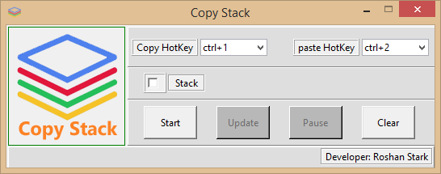

# CopyStack
This software allows you copy multiple items and paste in order (gives you much flexibility).

How to use it :

(1) Select the hotkeys for copy and paste if you want, else leave it as it is.

(2) If you check the stack it means your copied items will come out in reverse order (Last In First Out)

(3) Press Start to start

(4) If you want to pause, press pause.

(5) If you want to clear the stack, then you can press clear button.
